#### Description
- Worked on a Cisco Catalyst SD-WAN built on EVE-NG hosted in Google Cloud.
- Onboarded Control Components (Manager, Controller, Validator) along with C8000V WAN Edge routers and
- analyzed their communications.
- Configured centralized and localized policies to implement use cases, including custom Hub-and-Spoke, service
- chaining, path manipulation, DIA (Direct Internet Access), application performance optimization, route leaking, on-demand tunneling.
- Implemented VRRP for high availability and TLOC Extension to allow WAN Edge router to communicate over adjacent WAN Edge router transports.
---
#### Lab-Specs
##### Platform

| Environment     | Google Cloud                                  |
| --------------- | --------------------------------------------- |
| OS              | Ubuntu 22.04.5 LTS                            |
| Netsim          | eve-ng 6.2.0-4                                |
| Virtualization  | kvm                                           |
| Kernel          | Linux 6.7.5-eveng-6-ksm+                      |
| Architecture    | x86-64                                        |
| Hardware Vendor | Google                                        |
| Hardware Model  | Google Compute Engine                         |
| Model name      | INTEL(R) XEON(R) PLATINUM 8581C CPU @ 2.10GHz |
| CPU             | vCPU 16                                       |
| Vendor ID       | GenuineIntel                                  |
| Drive           | 250G SSD                                      |
| Memory          | 96G                                           |

---
##### Devices and Appliances

| Device Type         | Addon Type | Template             | Image                                           | Filename                       | Quantity | Remarks                                       |
| ------------------- | ---------- | -------------------- | ----------------------------------------------- | ------------------------------ | -------- | --------------------------------------------- |
| Catalyst Manager    | qemu       | Viptela vManage      | vtmgmt-20.13                                    | virtioa.qcow2 + virtioab.qcow2 | 1        | viptela-vmanage-20.15.5.2-genericx86-64.qcow2 |
| Catalyst Validator  | qemu       | Viptela vBond        | vtbond-20.13                                    | virtioa.qcow2                  | 1        | viptela-bond-20.15.5.2-genericx86-64.qcow2    |
| Catalyst Controller | qemu       | Viptela vSmart       | vtsmart-20.13                                   | virtioa.qcow2                  | 2        | viptela-vsmart-20.15.5.2-genericx86-64.qcow2  |
| Firewall            | qemu       | Palo Alto            | paloalto-11.0.0                                 | virtioa.qcow2                  | 3        |                                               |
| Router              | dynamips   | Cisco IOS 7206VXR    | c7200-adventerprise9-mz.153-3.XB12.image        | virtioa.qcow2                  | 15       |                                               |
| Router              | qemu       | Cisco Catalyst 8000v | c8000v-17.13.01a                                | virtioa.qcow2                  | 8        |                                               |
| L2 Switch           | qemu       | Cisco vIOS Switch    | viosl2-adventerprisek9-m.SSA.high_iron_20200929 | virtioa.qcow2                  | 8        |                                               |

---
##### PKI (Public Key Infrastructure)

|                                                    |             |                     |
| -------------------------------------------------- | ----------- | ------------------- |
| PKI Type: catalyst-mng as CA – `SDWAN-ROOT-CA.pem` |             |                     |
| Device                                             | CSR name    | Certificate name    |
| catalyst-mng                                       | vmanage_csr | catalyst-mng.crt    |
| catalyst-vldtr                                     | vbond_csr   | catalyst-vldtr.crt  |
| catalyst-ctrl01                                    | vsmart_csr  | catalyst-ctrl01.crt |
| catalyst-ctrl02                                    | vsmart2_csr | catalyst-ctrl01.crt |

---
#### Project Images
* 0). Login Dashboard
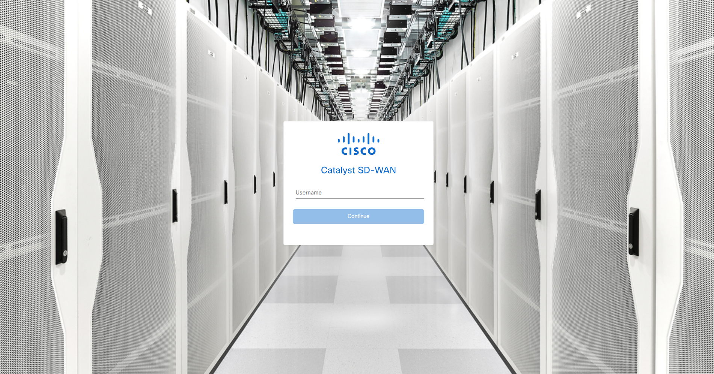
* 1). Topology
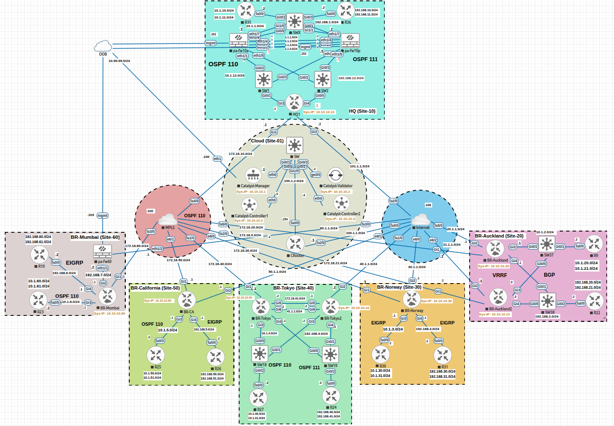
* 2). Control Components status
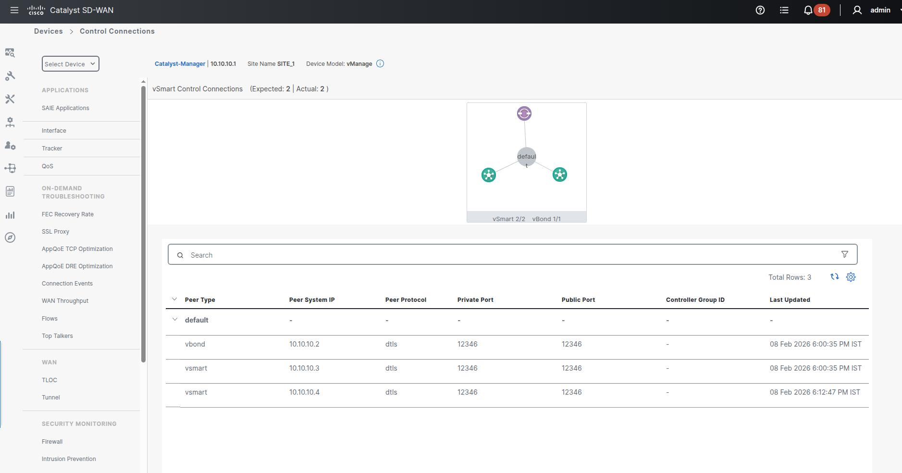
* 3). Overview of WAN Edges and Control Components
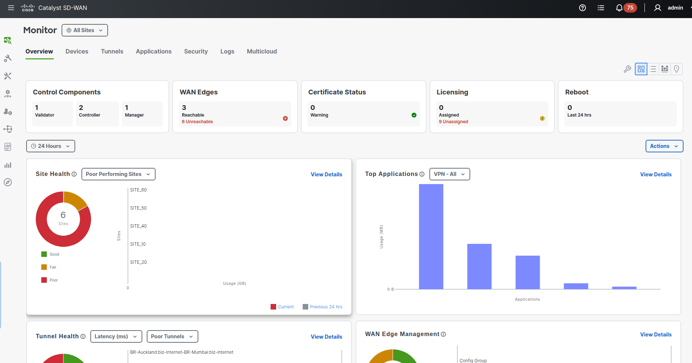
* 4). Device Template Creation
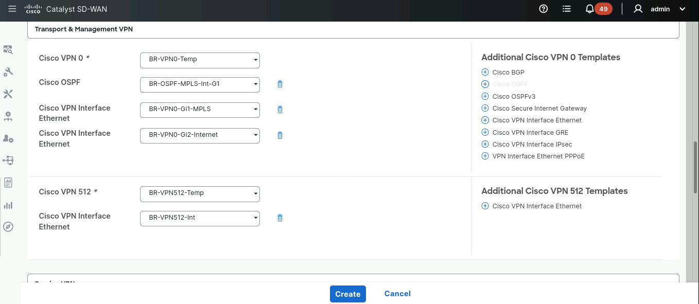
* 5). Updating Device Template
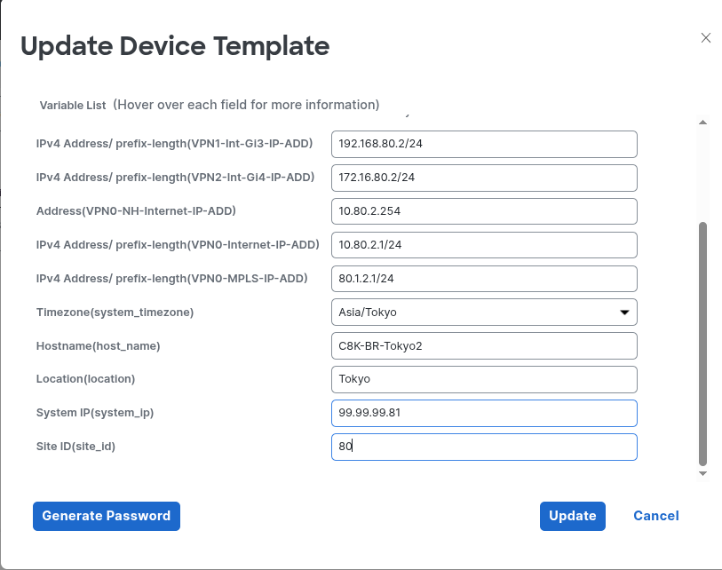
* 6). Tunnel Dashboard
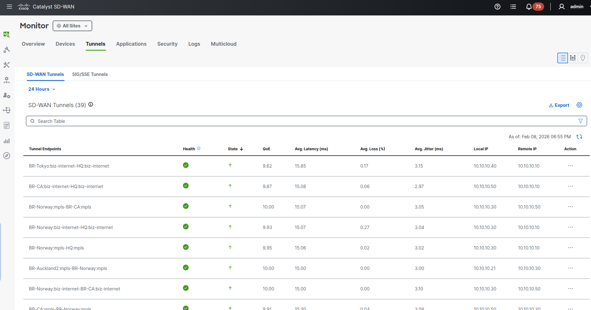
* 7). OMP Routes
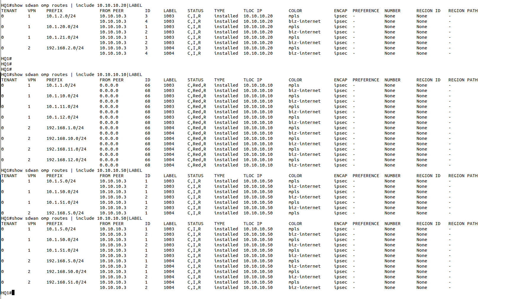
* 8). Hub and Spoke Toplogy
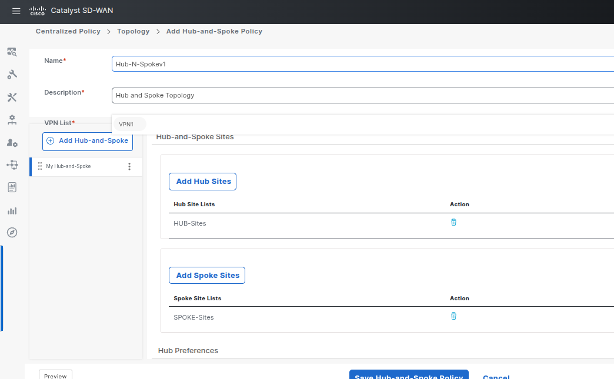
* 9). Custom Hub and Spoke Toplogy
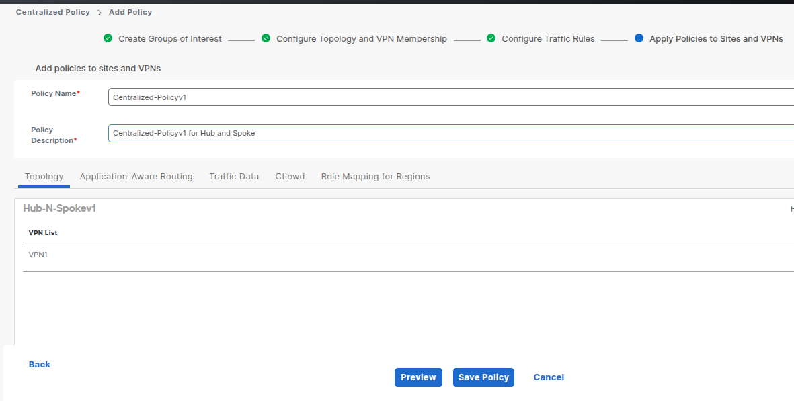
* 10). Ultimate TLOC
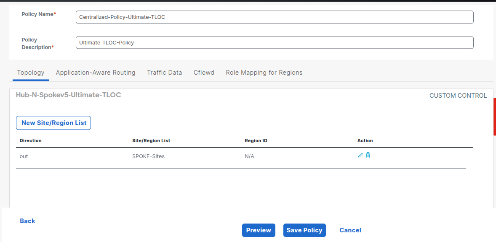
* 11). DIA Configuration
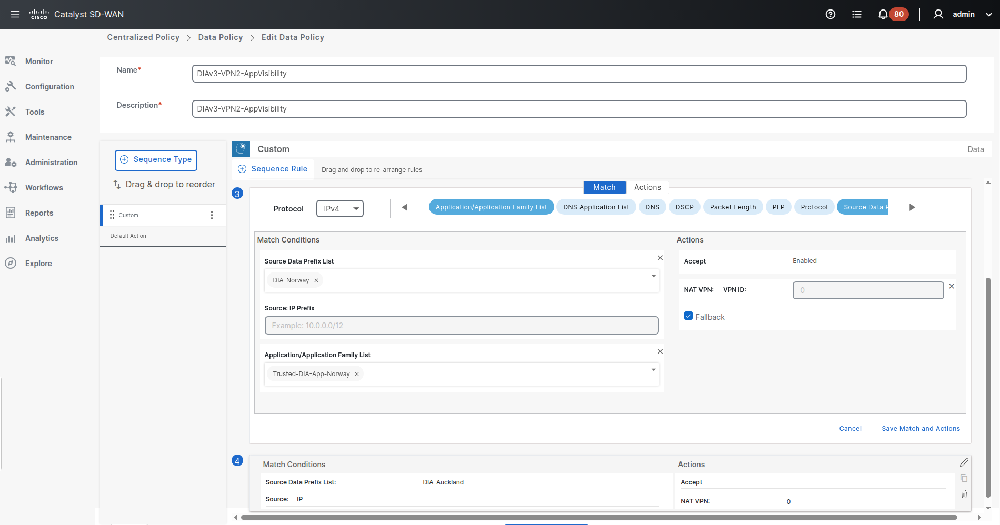
* 12). Flow Simulation
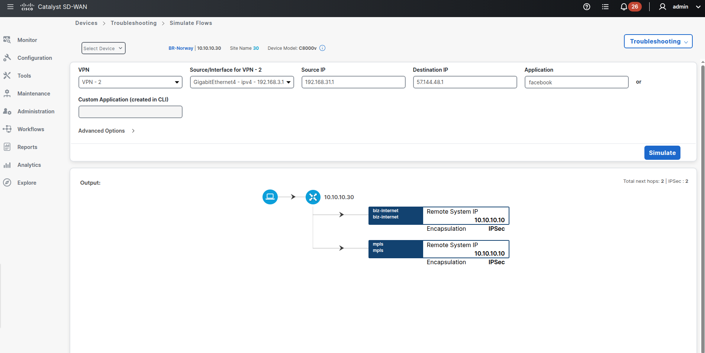
---
#### Working (Better version)
* Currently working on latest version with better topology design
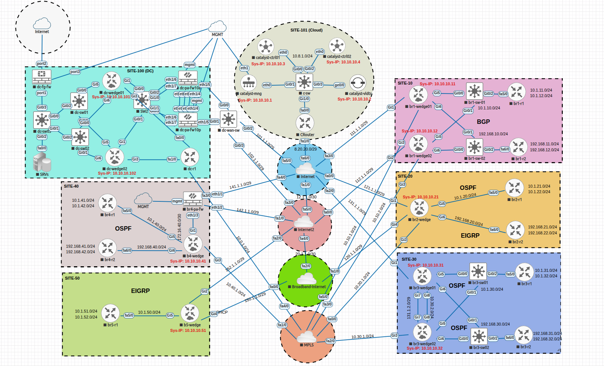